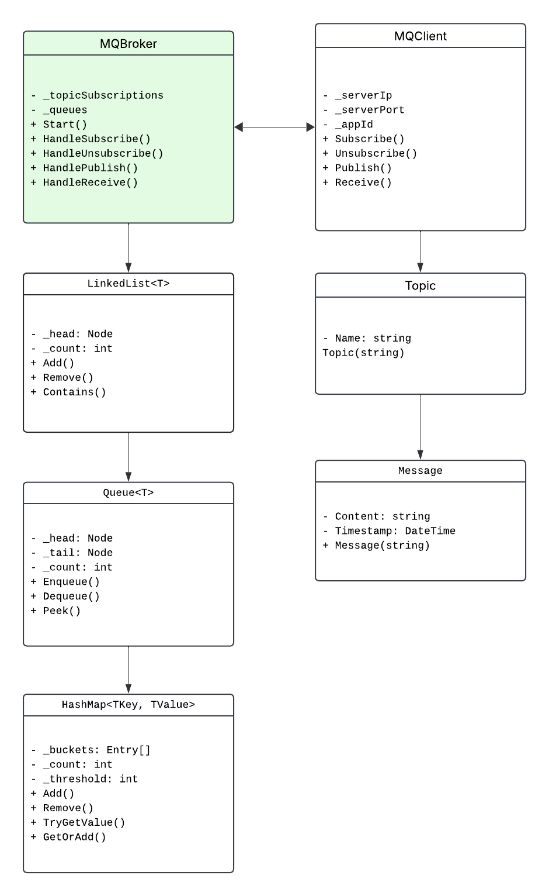

# Sistema de Mensajería para Comunicación Asincrónica entre Aplicaciones Distribuidas

## Descripción del Proyecto

Este proyecto implementa un sistema de mensajería para comunicar asincrónicamente aplicaciones distribuidas. El sistema sigue un modelo publicador/suscriptor, donde un componente central (broker) gestiona las colas de mensajes y facilita la comunicación entre aplicaciones sin que estas necesiten conocerse entre sí. Esto permite una comunicación asincrónica, donde los mensajes pueden enviarse y recibirse en momentos diferentes, mejorando la escalabilidad y desacoplamiento de los sistemas.

## Estructura del Proyecto

El proyecto se compone de tres componentes principales:

1. **MQBroker**: Aplicación de consola que gestiona las colas y transmite mensajes entre las colas.
2. **MQClient Library**: Biblioteca que permite a los clientes interactuar con el broker.
3. **GUI Application**: Interfaz gráfica para probar las funcionalidades del sistema MQBroker.

## Requerimientos

- .NET 5.0 o superior

## Instrucciones de Instalación

1. **Clonar el repositorio:**

   ```bash
   git clone https://github.com/JimenaCastillo/Message-Queue.git
   cd Message-Queue
   ```

2. **Abrir la solución en Visual Studio:**

   - Abre Visual Studio.
   - Selecciona **Archivo > Abrir > Proyecto/Solución**.
   - Navega hasta la carpeta donde clonaste el repositorio y abre el archivo `MessageQueue.sln`.

3. **Compilar la solución:**

   - Presiona **Ctrl+Shift+B** para compilar toda la solución.

## Ejecución del Proyecto

### Ejecución del Broker

1. Inicia el proyecto `MessageQueue.Broker`:
   - Haz clic derecho en el proyecto `MessageQueue.Broker` en el Explorador de soluciones.
   - Selecciona **Establecer como proyecto de inicio**.
   - Presiona **F5** para iniciar la depuración.

### Ejecución de la Aplicación GUI

1. Inicia el proyecto `MessageQueue.GUI`:
   - Haz clic derecho en el proyecto `MessageQueue.GUI` en el Explorador de soluciones.
   - Selecciona **Establecer como proyecto de inicio**.
   - Presiona **F5** para iniciar la depuración.

## Uso de la Aplicación GUI

La aplicación GUI proporciona una interfaz para interactuar con el sistema de mensajería:

1. **Configuración de Conexión:**
   - Ingresa la dirección IP del servidor y el puerto donde está escuchando el broker.
   - Verifica que el AppID se genere automáticamente.

2. **Suscripción a un Tema:**
   - Ingresa el nombre del tema en el campo "Tema".
   - Haz clic en "Suscribirse".

3. **Desuscripción de un Tema:**
   - Ingresa el nombre del tema en el campo "Tema".
   - Haz clic en "Desuscribirse".

4. **Publicación de Mensajes:**
   - Ingresa el nombre del tema en el campo "Tema".
   - Ingresa el contenido del mensaje en el campo "Mensaje".
   - Haz clic en "Publicar".

5. **Recepción de Mensajes:**
   - Ingresa el nombre del tema en el campo "Tema".
   - Haz clic en "Recibir mensaje".
   - Los mensajes recibidos aparecerán en la lista de mensajes.

## Estructuras de Datos Implementadas

El proyecto utiliza estructuras de datos personalizadas para gestionar las colas y suscripciones:

1. **Lista Enlazada Simple (LinkedList)**
2. **Cola (Queue)**
3. **Tabla Hash (HashMap)**

Estas estructuras han sido implementadas desde cero para cumplir con los requerimientos del curso de Algoritmos y Estructuras de Datos.

## Diagrama de Clases UML



## Contribuciones

Las contribuciones son bienvenidas. Por favor, sigue los siguientes pasos:

1. Haz un fork del repositorio.
2. Crea una nueva rama (`git checkout -b feature/nueva-funcionalidad`).
3. Realiza los cambios necesarios y haz commit (`git commit -am 'Añadir nueva funcionalidad'`).
4. Sube los cambios a tu rama (`git push origin feature/nueva-funcionalidad`).
5. Crea un Pull Request.

## Licencia

Este proyecto está bajo la Licencia Apache-2.0. Para más detalles, consulta el archivo [LICENSE](LICENSE).

---

Desarrollado por [Jimena Castillo](https://github.com/JimenaCastillo) y [Adrian Monge Mairena](https://github.com/Preko700) como parte del curso de Algoritmos y Estructuras de Datos I.

---

Este archivo README es una guía de referencia rápida para entender, instalar y utilizar el proyecto de Sistema de Mensajería para Comunicación Asincrónica entre Aplicaciones Distribuidas. Si tienes alguna pregunta o problema, no dudes en abrir un issue en el repositorio.
